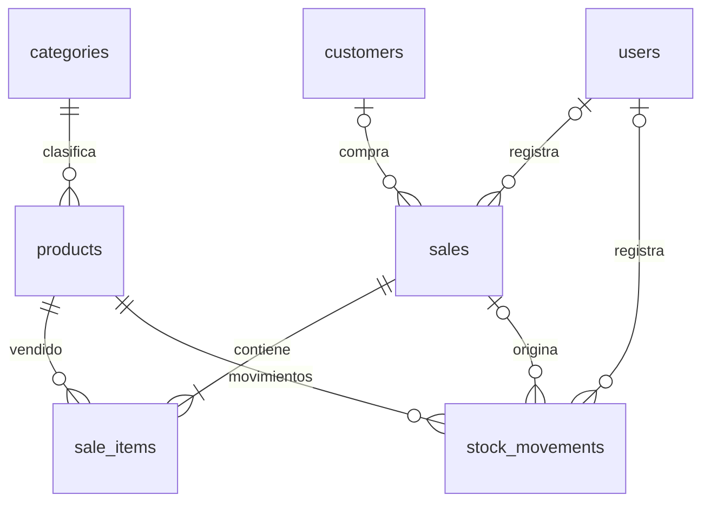

# InVenta — Ventas e inventario

Aplicación web para administrar clientes, productos, categorías, ventas, comprobantes imprimibles, inventario, usuarios y reportes. Incluye una gráfica de ventas por período y personalización de colores.

La carpeta de la aplicación es **`sistema-facturacion-ins/`**. Ejecuta allí todos los comandos de Laravel, Composer y npm. El nombre del repositorio conserva la denominación anterior del proyecto.

## Contenido

- [Alcance y tecnologías](#alcance-y-tecnologías)
- [Clonación e instalación en otra laptop](#clonación-e-instalación-en-otra-laptop)
- [Primer administrador](#primer-administrador)
- [Manual de uso](#manual-de-uso)
- [Roles y permisos](#roles-y-permisos)
- [Base de datos](#base-de-datos)
- [Seguridad](#seguridad)
- [Respaldos y traslado de datos](#respaldos-y-traslado-de-datos)
- [Actualización y publicación](#actualización-y-publicación)
- [Pruebas y solución de problemas](#pruebas-y-solución-de-problemas)
- [Estructura y escalabilidad](#estructura-y-escalabilidad)

## Alcance y tecnologías

InVenta está orientado a pequeños comercios de productos, como ferreterías, papelerías y tiendas de accesorios. Trabaja con **un negocio y un inventario compartido**, cantidades enteras y dos roles: administrador y vendedor.

| Componente | Tecnología del proyecto |
|---|---|
| Servidor | PHP `^8.3`, Laravel `^13.17` |
| Interfaz | Blade, Tailwind CSS 4 y JavaScript |
| Recursos | Vite 8 y npm |
| Datos | Eloquent y migraciones; configuración para SQLite y MySQL, entre otros motores de Laravel |
| Acceso | Autenticación por sesiones y controles propios de rol/estado |
| Pruebas | Pest 4 y PHPUnit |
| Zona horaria | `America/El_Salvador`, en `config/app.php` |

Los importes usan `$` y los reportes indican USD; no hay gestión de varias monedas. El impuesto es configurable y su valor inicial es 13 %. Indicar tarjeta o transferencia solo registra la forma de pago: **no procesa cobros bancarios**.

Los comprobantes son documentos internos imprimibles. **No hay integración implementada de documentos tributarios electrónicos ni certificación fiscal.** Antes de utilizarlos como factura legal, deben verificarse e implementarse los requisitos de la jurisdicción correspondiente.

## Clonación e instalación en otra laptop

### 1. Requisitos

Instala Git, Composer 2, PHP compatible y Node.js con npm. Se recomienda Node.js 22.12 o superior dentro de una versión compatible: el Vite de `package-lock.json` exige `^20.19.0 || >=22.12.0`.

PHP debe cumplir `^8.3` y las restricciones de `composer.lock`. Composer verificará las extensiones. Son relevantes PDO con su controlador (`pdo_mysql` para MySQL; `pdo_sqlite`/`sqlite3` para SQLite), mbstring, XML, OpenSSL y las demás extensiones que indique Composer.

**Comprueba el PHP de XAMPP:** versiones antiguas pueden traer PHP 8.2 o anterior, incompatible con este proyecto. Si utilizas Apache, tanto su PHP como el de la terminal deben ser compatibles.

En PowerShell:

```powershell
git --version
php -v
composer --version
node -v
npm -v
php -m
Get-Command php
```

XAMPP es opcional: puede aportar MySQL/MariaDB y Apache. También puedes iniciar el servidor local con Artisan. Docker no es obligatorio.

### 2. Clonar e instalar dependencias

Ejemplo con XAMPP en Windows:

```powershell
Set-Location C:\xampp\htdocs
git clone https://github.com/Willrdgz/Sistema-de-Facturaci-n-INS-.git
Set-Location .\Sistema-de-Facturaci-n-INS-\sistema-facturacion-ins
composer install
composer check-platform-reqs
npm ci
```

Puedes clonar en otra carpeta de tu elección. Si el repositorio es privado, necesitas acceso con tu cuenta de GitHub. `composer install` y `npm ci` respetan las versiones bloqueadas; `composer update` cambia dependencias y no es un paso normal de instalación. No ignores requisitos de plataforma para resolver una incompatibilidad.

**Git solo descarga cambios publicados.** Para tener en la nueva laptop las modificaciones locales, primero deben confirmarse y enviarse al repositorio. Clonar no transfiere `.env`, contraseñas, base de datos, `vendor/`, `node_modules/` o `public/build/`.

### 3. Configurar `.env`

Solo cuando todavía no exista `.env`, crea uno:

```powershell
Copy-Item .env.example .env
```

Edita el archivo en tu editor:

```dotenv
APP_NAME=InVenta
APP_ENV=local
APP_DEBUG=true
APP_URL=http://127.0.0.1:8000
APP_LOCALE=es
APP_FALLBACK_LOCALE=en
```

Elige **una** de estas opciones de base de datos.

#### Opción A: MySQL/MariaDB de XAMPP

Inicia MySQL desde XAMPP y crea una base vacía en phpMyAdmin o con SQL:

```sql
CREATE DATABASE inventa CHARACTER SET utf8mb4 COLLATE utf8mb4_unicode_ci;
```

En `.env`:

```dotenv
DB_CONNECTION=mysql
DB_HOST=127.0.0.1
DB_PORT=3306
DB_DATABASE=inventa
DB_USERNAME=root
DB_PASSWORD=
```

Este ejemplo corresponde a una configuración local habitual; adapta puerto y credenciales. En producción usa un usuario exclusivo con contraseña y permisos limitados, no `root`.

#### Opción B: SQLite para desarrollo

La plantilla `.env.example` utiliza SQLite. Crea el archivo solo si no existe:

```powershell
if (-not (Test-Path database/database.sqlite)) {
    New-Item -ItemType File -Path database/database.sqlite | Out-Null
}
```

Deja `DB_CONNECTION=sqlite` y elimina o comenta el `DB_DATABASE` de MySQL. Laravel utilizará `database/database.sqlite`. Si indicas una ruta explícita en `DB_DATABASE`, debe ser absoluta y válida en la nueva laptop.

SQLite sirve para desarrollo y pruebas. Para operaciones concurrentes de inventario conviene evaluar MySQL/MariaDB con InnoDB: los bloqueos por fila usados en el código no funcionan igual en SQLite.

### 4. Crear tablas y recursos

Para una **instalación nueva**, sin datos previos:

```powershell
php artisan key:generate
php artisan config:clear
php artisan migrate
npm run build
```

Las migraciones crean tablas, relaciones y colores personalizados. `.env.example` utiliza sesiones, caché y colas en base de datos; sus tablas se incluyen en las migraciones.

Opcionalmente, en una base de demostración:

```powershell
php artisan db:seed
```

El seeder agrega Ferretería El Progreso, categorías, un cliente y tres productos. **No crea usuarios ni administrador.** No lo ejecutes sobre datos reales si no deseas esos registros. Los productos de ejemplo se insertan directamente con stock; no generan movimientos iniciales mediante el controlador de productos.

### 5. Iniciar

Crea una cuenta según [Primer administrador](#primer-administrador) y luego ejecuta:

```powershell
php artisan serve
```

Abre [http://127.0.0.1:8000/login](http://127.0.0.1:8000/login). Mantén abierta la terminal; `Ctrl + C` detiene el servidor.

Si editas estilos o JavaScript, abre otra terminal en la aplicación y ejecuta `npm run dev`. Para utilizar los recursos ya compilados basta con `npm run build`; Vite no necesita permanecer abierto.

Para Apache, configura un sitio/VirtualHost con `DocumentRoot` en **`sistema-facturacion-ins/public`**, reescritura de URL habilitada y `APP_URL` correspondiente. No publiques la raíz del repositorio ni la de Laravel: contienen archivos privados.

## Primer administrador

No hay credenciales predeterminadas ni registro público. En una instalación nueva, desde una terminal local confiable:

```powershell
php artisan tinker
```

Dentro de Tinker ejecuta las líneas por separado, reemplazando nombre y correo:

```php
$password = \Illuminate\Support\Str::password(20);
\App\Models\User::create(['name' => 'Administrador', 'email' => 'admin@example.com', 'password' => $password, 'role' => 'admin', 'active' => true]);
echo $password;
exit
```

La contraseña generada se muestra en tu terminal: guárdala de forma privada y no compartas capturas. El modelo aplica el hash automáticamente. El correo debe ser único. Después de entrar puedes cambiarla desde **Usuarios → Editar** y crear las demás cuentas.

Si importaste una base completa, utiliza sus cuentas existentes; no crees otra con el mismo correo. No publiques contraseñas reales en el README, Git o archivos de ejemplo.

## Manual de uso

### Preparación

1. Entra con una cuenta administradora y registra los datos del negocio e impuesto en **Configuración**.
2. Crea **Categorías** antes de agregar productos.
3. Registra **Productos** con código único, categoría, costo, precio, stock inicial y stock mínimo.
4. Agrega **Clientes** y crea cuentas para vendedores en **Usuarios**.

El stock inicial se registra al crear un producto. Los cambios posteriores de existencias deben hacerse desde **Inventario**, para conservar el historial; editar un producto no reemplaza su stock.

### Panel, clientes, categorías y productos

El panel muestra ventas vigentes de hoy y cantidad de operaciones, clientes/productos activos, ventas recientes y alertas por stock menor o igual al mínimo. La consulta actual de alertas también puede incluir productos desactivados. Las ventas recientes pueden incluir anuladas; el resumen de ingresos cuenta solo vigentes.

- **Clientes:** buscar por nombre/documento, registrar contacto, editar o desactivar; ambos roles pueden gestionarlos.
- **Categorías:** el administrador crea, edita y desactiva. No se permite desactivar una categoría con productos asociados.
- **Productos:** ambos roles consultan y buscan por nombre/código; solo el administrador registra, edita y desactiva.
- Desactivar conserva registros e historial. Las ventas ofrecen clientes activos y productos activos con stock disponible.

### Registrar ventas

1. Pulsa **Nueva venta**.
2. Selecciona cliente o deja **Consumidor final**.
3. Elige efectivo, tarjeta o transferencia.
4. Agrega productos y cantidades. Un producto no puede repetirse: aumenta su cantidad si corresponde.
5. Agrega descuento/notas, revisa el resumen y pulsa **Guardar y generar factura**.

El servidor toma los precios del catálogo, verifica disponibilidad y recalcula el total. La interfaz ofrece un cálculo preliminar; la validación definitiva ocurre al guardar.

```text
Subtotal = suma de precio × cantidad
Base del impuesto = subtotal − descuento
Impuesto = base × porcentaje / 100, redondeado a centavos
Total = subtotal − descuento + impuesto
```

Se rechazan descuentos superiores al subtotal, cantidades inválidas, productos inactivos y existencias insuficientes. La venta, sus detalles, descuento de stock y movimientos se guardan en una transacción. El comprobante usa `FAC-` y parte de un UUID; no es una numeración fiscal autorizada.

### Consultar, imprimir y anular ventas

En **Ventas**, busca el número de factura o filtra por fechas. Abre el detalle para revisar productos e imprimir mediante el navegador; puedes elegir «Guardar como PDF». No se genera un PDF independiente en el servidor.

Solo el administrador puede **anular** con un motivo. Se mantiene la venta, se devuelven existencias y se registran movimientos de devolución. No se puede anular dos veces. No hay edición de ventas ya guardadas.

Se guardan copias históricas de datos del negocio, cliente, nombre del producto, precio e impuesto. Cambios posteriores no reemplazan esos campos de la venta; el usuario se consulta mediante su relación actual.

### Inventario

Registra **entradas/salidas** con cantidad y motivo. No se permite dejar stock negativo. El historial registra producto, responsable, cantidad, saldo resultante y venta vinculada si corresponde.

Tipos internos: `opening` (inicial), `in` (entrada), `out` (salida), `sale` (venta), `return` (anulación). El historial está paginado. **El vendedor también puede registrar movimientos**; restringirlo requiere cambiar el permiso.

### Reportes

Selecciona **Desde/Hasta** y pulsa **Consultar**. Por defecto se consulta desde el inicio del mes hasta hoy.

- **Ventas vigentes:** suma de operaciones con estado `completed`.
- **Valor de inventario:** existencias actuales por costo de productos activos; no es valor histórico del período ni cálculo de utilidad.
- **Gráfica:** ventas vigentes de todo el período, independiente de la página de la tabla, con días sin ventas. En períodos largos agrupa en intervalos para mostrar como máximo 31 barras. El cursor muestra importes y cantidades.
- **Tabla y CSV:** incluyen vigentes y anuladas, identificadas por estado. El CSV abarca el período completo.
- **Imprimir:** usa el navegador y oculta menú y controles principales.

La gráfica usa el color principal y admite desplazamiento horizontal en pantallas pequeñas.

### Usuarios y personalización

El administrador crea y edita nombre, correo, rol, contraseña y estado en **Usuarios**. Deja la contraseña vacía al editar si quieres conservarla. Nuevas contraseñas requieren al menos 10 caracteres y confirmación. No se permite desactivar o cambiar el rol del último administrador activo.

Los colores de **Configuración** se aplican a **todos los usuarios** cuando guardas. «Restablecer colores originales» actualiza los selectores; también debes guardar.

| Zona | Color original de la configuración |
|---|---|
| Menú lateral | `#020617` |
| Fondo | `#F1F5F9` |
| Botones y opción activa | `#059669` |
| Barra superior | `#FFFFFF` |

El texto y el logo lateral se adaptan al contraste. Las tarjetas siguen blancas y algunos indicadores conservan colores semánticos. En escritorio, desde 1024 px, el menú permanece visible al desplazar contenido y tiene scroll propio si no cabe completo.

## Roles y permisos

| Acción | Administrador | Vendedor |
|---|---|---|
| Panel y consulta de productos | Sí | Sí |
| Crear/editar/desactivar clientes | Sí | Sí |
| Registrar/consultar ventas | Sí | Sí |
| Consultar/registrar movimientos de inventario | Sí | Sí |
| Administrar productos y categorías | Sí | No |
| Anular ventas | Sí | No |
| Reportes, CSV y configuración | Sí | No |
| Administrar usuarios | Sí | No |

Las rutas exigen autenticación y cuenta activa; las administrativas verifican el rol en el servidor. Ocultar el menú no es la única protección. Los vendedores ven las ventas del negocio, no solamente las propias.

## Base de datos

Las migraciones de `database/migrations/` definen el esquema. Consulta su estado con `php artisan migrate:status`.

| Tabla | Información |
|---|---|
| `businesses` | Datos del negocio, impuesto y `theme_colors` en JSON |
| `users` | Nombre, correo único, hash de contraseña, rol y estado |
| `customers` | Nombre, documento único opcional, contacto, dirección y estado |
| `categories` | Nombre único, descripción y estado |
| `products` | Categoría, código único, costo/precio decimales, existencias y mínimo |
| `sales` | Cliente/vendedor, número único, fecha, forma de pago, importes, estado, anulación y copias históricas JSON |
| `sale_items` | Venta, producto, nombre histórico, precio, cantidad y total de línea |
| `stock_movements` | Producto, usuario, venta opcional, tipo, cantidad, saldo y motivo |
| `sessions` | Sesiones con el controlador de base de datos |
| `password_reset_tokens` | Tabla del framework; no hay flujo de recuperación implementado |
| `cache`, `cache_locks` | Caché y bloqueos |
| `jobs`, `job_batches`, `failed_jobs` | Infraestructura de colas, sin implicar procesos de negocio en segundo plano |



Las claves foráneas restringen borrar productos referenciados y categorías con productos. Algunas referencias de cliente/usuario quedan nulas si se eliminan físicamente; la interfaz utiliza desactivación. Los detalles tienen eliminación en cascada si se borra físicamente una venta, pero la aplicación ofrece anulación.

El saldo actual está en `products` y los cambios en `stock_movements`. No hay tablas de sucursales, compras o proveedores. La configuración consulta el primer negocio; no existe aislamiento de datos multiempresa.

## Seguridad

### Implementado

- Autenticación con correo/contraseña y estado activo.
- Limitación tras cinco intentos fallidos por combinación de correo/IP, con ventana de 60 segundos.
- Renovación de sesión al entrar; invalidación y renovación de token al salir o desactivar una cuenta.
- Middleware de administrador y cuenta activa.
- Protección CSRF, validación del servidor, consultas parametrizadas en los flujos revisados y escape normal de salida Blade.
- Contraseñas con hash en el modelo `User`, ocultas al serializarlo.
- Transacciones y bloqueos para ventas, inventario y anulaciones en motores que los soportan.
- Cálculos monetarios de ventas en centavos en el servidor; no confía en precios del navegador.
- Colores restringidos a hexadecimal de seis dígitos y comprobados antes de insertarlos en CSS.
- Medida de protección en CSV: apóstrofo para valores que empiezan con `=`, `+`, `@` o `-`.

Estos controles **no equivalen a una auditoría completa ni certificación**. Existe trazabilidad de ventas/movimientos, pero no un registro integral e inmutable de todos los cambios.

### Para publicar

Configura HTTPS y adapta `.env`:

```dotenv
APP_NAME=InVenta
APP_ENV=production
APP_DEBUG=false
APP_URL=https://tu-dominio.example
SESSION_SECURE_COOKIE=true
SESSION_HTTP_ONLY=true
SESSION_SAME_SITE=lax
```

Conserva `APP_KEY` válida y privada. Genera una clave para una instalación independiente nueva; al trasladar la misma instalación conserva la original. No la regeneres rutinariamente, porque puede invalidar datos cifrados y cookies.

Mantén `.env`, credenciales y respaldos fuera de Git y de `public/`. Usa cuentas individuales y permisos apropiados para la base y archivos. Solo concede escritura donde la aplicación la necesite, como `storage/` y `bootstrap/cache/`. Revisa dependencias periódicamente.

No hay segundo factor, recuperación de contraseña desde la interfaz, verificación obligatoria de correo, permisos granulares ni separación por empresa. `.env.example` tiene `SESSION_ENCRYPT=false`; no asumas que las sesiones en base de datos están cifradas por defecto.

## Respaldos y traslado de datos

**Clonar no copia los datos del negocio.** Para trasladar usuarios, productos, ventas, inventario y colores necesitas una copia coherente de la base y la configuración privada pertinente.

### MySQL/MariaDB

1. Haz un respaldo y evita nuevas operaciones durante la transferencia, para no dejar ventas posteriores fuera de la copia.
2. En phpMyAdmin selecciona la base y usa **Exportar → SQL**, incluyendo estructura y datos. Guarda el archivo fuera del repositorio y de `public/`.
3. Instala el código y dependencias en la nueva laptop y crea una base vacía compatible.
4. Importa el SQL; no lo hagas sobre datos que quieras conservar.
5. Configura las nuevas credenciales en `.env`. Conserva la `APP_KEY` original al trasladar la misma instalación; transfiérela de forma privada.
6. Ejecuta `php artisan config:clear`, `php artisan migrate` y `npm run build`.
7. Accede con un usuario existente y comprueba existencias, ventas, usuarios, configuración y reportes.

**No ejecutes seeder ni crees otra vez el administrador al importar una base completa.** `migrate` solo aplica migraciones pendientes si la tabla de migraciones se restauró correctamente.

### SQLite

Detén la aplicación y procesos que escriban antes de copiar `database/database.sqlite`. Si hay archivos WAL/diario activos, usa un respaldo consistente de SQLite o un cierre limpio; no copies solo el archivo principal mientras recibe escrituras. Ajusta las rutas absolutas de `.env` y conserva la configuración privada necesaria en el destino. Aplica las migraciones pendientes.

Un SQL de MySQL no puede importarse directamente como base SQLite; cambiar motor requiere conversión y validación.

### Respaldo habitual

- Respalda con una frecuencia acorde a la pérdida de datos tolerable, por ejemplo diariamente y antes de actualizar.
- Mantén copias fuera de la laptop con acceso restringido.
- Conserva configuración y clave de forma privada; incluye archivos persistentes de `storage/app/` si se incorporan funciones que los utilicen.
- Prueba la restauración periódicamente en una base separada.
- El CSV es una exportación parcial, **no un respaldo completo**.

No hay respaldos automáticos implementados. Dos laptops con bases independientes no sincronizan operaciones; para compartir datos necesitan una instalación central o una solución de sincronización desarrollada expresamente.

## Actualización y publicación

Primero respalda y revisa `git status`. Resuelve cambios locales antes de descargar actualizaciones; no los borres indiscriminadamente.

Desde `sistema-facturacion-ins/`:

```powershell
git pull --ff-only
composer install
npm ci
php artisan migrate
npm run build
php artisan optimize:clear
```

No sobrescribas `.env` ni regeneres la clave al actualizar. En producción, tras validar, puedes ejecutar `php artisan config:cache` y `php artisan view:cache`.

Publica con un servidor web cuya raíz sea `public/`, HTTPS y base de datos restringida. `artisan serve` es para desarrollo. No hay un despliegue Docker preparado en esta guía. Las ventas y reportes actuales son sincrónicos; tener tablas de colas no significa que se ejecuten en segundo plano.

`composer dev` inicia servidor, escucha de colas y Vite; verifica su compatibilidad con tu entorno. No sustituye una configuración de producción.

**No utilices `migrate:fresh`, `migrate:refresh` ni rollback como actualización normal de una base real:** pueden eliminar tablas, columnas o datos. No ejecutes pruebas contra la base de producción.

## Pruebas y solución de problemas

Con dependencias de desarrollo instaladas:

```powershell
composer test
```

`phpunit.xml` usa SQLite en memoria. Necesitas sus extensiones y evitar configuración de producción almacenada en caché; `composer test` limpia la configuración antes de las pruebas.

Comprobaciones específicas:

```powershell
php artisan test --filter=SystemWorkflowTest
php artisan test --filter=ThemeSettingsTest
php artisan test --filter=ReportChartTest
npm run build
```

Hay pruebas de acceso, permisos, cuentas inactivas, ventas, inventario, anulaciones, CSV, colores y gráficas. No son pruebas de carga ni auditoría de seguridad. `tests/browser/system.cjs` es un auxiliar con Playwright externo mediante `INS_PLAYWRIGHT`, ruta de Chrome de Windows y cuenta de prueba preparada; requiere adaptación para otra laptop.

| Problema | Revisión |
|---|---|
| Composer rechaza PHP | Comprueba `php -v`, `Get-Command php` y extensiones; no ignores restricciones |
| `could not find driver` | Habilita el controlador PDO correspondiente en el `php.ini` del PHP utilizado |
| No conecta MySQL | Servicio, puerto, base, usuario y contraseña; luego `php artisan config:clear` |
| SQLite no existe | Crea archivo solo en instalación nueva o corrige ruta; no reemplaces datos |
| Falta clave | Nueva instalación: `key:generate`; restauración: recupera la original |
| Faltan tablas/columnas | Revisa conexión, `migrate:status` y `migrate` |
| No inicia sesión | Confirma cuenta creada/importada, activa y contraseña correcta |
| Error 403 | Rol insuficiente para esa ruta |
| Error 419 | Recarga y revisa sesión, cookies y URL respecto a `APP_URL` |
| Falta manifiesto Vite | Ejecuta `npm ci` y `npm run build` |
| Estilos antiguos | Compila, recarga con `Ctrl + F5`; revisa un posible `public/hot` obsoleto de Vite |
| No escribe caché/logs | Permisos de `storage/` y `bootstrap/cache/` |
| Puerto 8000 ocupado | `php artisan serve --port=8001` y adapta `APP_URL` |
| Advertencia `fontaine` | Dependencia opcional de optimización de fuentes; comprueba el resultado final de compilación |

Revisa errores del servidor en `storage/logs/laravel.log`. No publiques registros sin retirar datos privados.

## Estructura y escalabilidad

```text
README.md                         Guía principal
sistema-facturacion-ins/
├── app/Http/Controllers/          Operaciones por módulo
├── app/Http/Middleware/           Estado activo y administrador
├── app/Http/Requests/             Validación de formularios
├── app/Models/                    Modelos y relaciones
├── bootstrap/app.php             Inicialización y middleware
├── config/                       Configuración
├── database/migrations/          Esquema
├── database/seeders/             Datos de demostración
├── public/images/                Logo de InVenta
├── resources/views/              Pantallas Blade
├── resources/css/                Estilos y colores
├── resources/js/                 Recursos JavaScript
├── routes/web.php                Rutas y permisos
└── tests/                        Pruebas
```

Laravel permite agregar módulos, pero no se ha establecido una capacidad de usuarios simultáneos mediante pruebas de carga. Paginación y transacciones son una base; crecer requiere medir consultas, revisar índices/servidor y probar concurrencia. Algunos selectores cargan todos los productos/clientes disponibles y los reportes agregan ventas del período.

No están implementados multiempresa, sucursales/almacenes, compras/proveedores, cuentas por cobrar, pagos parciales, integración bancaria, facturación electrónica, lotes/vencimientos, números de serie ni sincronización sin conexión. Las cantidades son enteras: peso y medidas fraccionarias necesitan cambios. Tallas/variantes requieren productos separados o ampliar el modelo.

Esta guía distingue las funciones actuales de las recomendaciones y ampliaciones pendientes. Antes de operar con datos reales, valida los flujos del negocio y prueba un respaldo y su recuperación.
